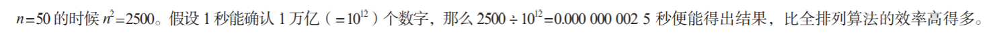
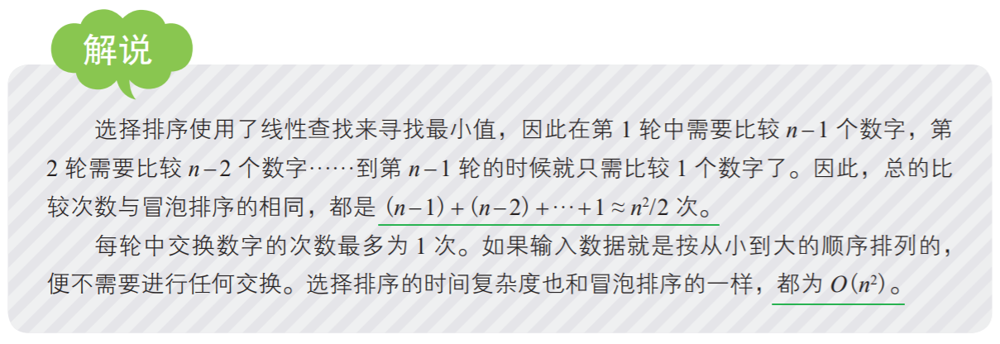
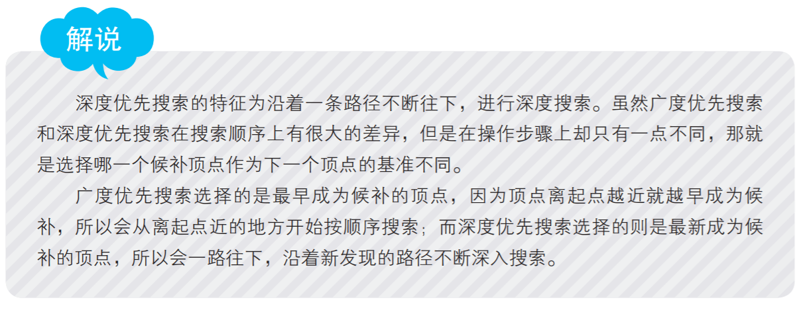
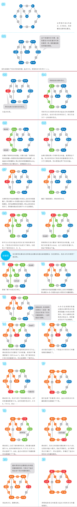
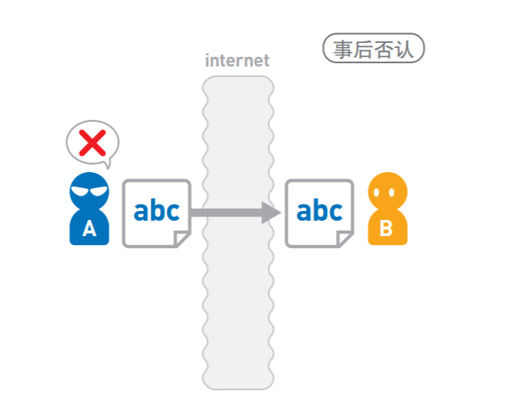
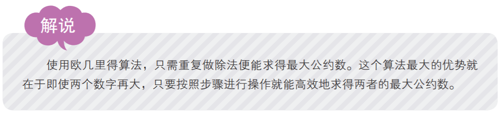

#  序章 - 算法的基本知识

## 1. 什么是算法

### 算法与程序的区别

算法就是计算或者解决问题的步骤。我们可以把它想象成食谱。

要想做出特定的料理，就要遵循食谱上的步骤；

同理，要想用计算机解决特定的问题，就要遵循算法。

这里所说的特定问题多种多样，比如“将随意排列的数字按从小到大的顺序重新排列”, “寻找出发点到目的地的
最短路径”，等等。

食谱和算法之间最大的区别就在于算法是严密的。食谱上经常会有描述得比较模糊的部分，
而算法的步骤都是用数学方式来描述的，所以十分明确。

算法和程序有些相似，区别在于程序是以计算机能够理解的编程语言编写而成的，可以在
计算机上运行，而算法是以人类能够理解的方式描述的，用于编写程序之前。

不过，在这个过程中到哪里为止是算法、从哪里开始是程序，并没有明确的界限。

就算使用同一个算法，编程语言不同，写出来的程序也不同。

即便使用相同的编程语言，写程序的人不同，那么写出来的程序也是不同的。

### 排列整数的算法：排序

#### 查找最小的数字并交换：选择排序

来看一个具体的算法示例吧。这是一个以随意排列的整数为输入，把它们按从小到大的顺序重新排
列的问题。

这类排序问题我们将在后面详细讲解。

只解决这一个问题很简单，但是算法是可以应对任意输入的计算步骤，所以必须采用通用的
描述。

虽然在这个示例中输入的整数个数 n 为 8，然而不管 n 多大，算法都必须将问题解决。

那么，你首先想到的方法，是不是先从输入的数字中找出最小的数字，再将它和最左边的数字交换位置呢？

在这个示例中就是找到最小数字 1，然后将它和最左边的 7 交换位置。

这之后 1 的位置便固定下来，不再移动。

接下来，在剩下的数字里继续寻找最小数，再将它和左边第 2 个数字交换位置。

于是，4 和 13 也交换了位置。

我们将这样的一次交换称为“1 轮”。

到了第 k 轮的时候，就把剩下的数字中最小的一个，与左边开始第 k 个数字进行交换。

于是在结束第 k 轮后，从左数的 k 个数字便都按从小到大的顺序排列了。

只要将这个步骤重复 n 次，那么所有的数字都将按从小到大的顺序排列。

这便是将在 2-3 节中介绍的选择排序。不管输入的数字是什么、n 有多大，都可以用这个算法解决问题。

#### 用计算机能理解的方式构思解法：算法的设计

计算机擅长高速执行一些基本命令，但无法执行复杂的命令。

此处的“基本命令”指的是 “做加法” 或者 “在指定的内存地址上保存数据” 等。

计算机是以这些基本命令的组合为基础运行的，面对复杂的操作，也是通过搭配组合这些基本命令来应对的。

上文中提到的 “ *对 n 个数字进行排序* ” 对计算机来说就是复杂的操作。

如何设计算法来解决这个排序问题，也就等同于构思如何搭配组合计算机可以执行的那些基本命
令来实现这个操作。

------

## 2. 如何选择算法

能解决排序问题的算法不止选择排序这一个。

那么，当有多个算法都可以解决同一个问题时，我们该如何选择呢？

在算法的评判上，考量的标准也各有不同。

比如，简单的算法对人来说易于理解，也容易被写成程序，而在运行过程中不需要耗费太
多空间资源的算法，就十分适用于内存小的计算机。

不过，一般来说我们最为重视的是算法的运行时间，即从输入数据到输出结果这个过程所
花费的时间。

------

## 3. 对 50 个数字排序所花的时间竟然比宇宙的历史还要长

### ▶ 使用全排列算法进行排序

为了体会一下低效率算法的效果，这里来看看下面这个排序算法 ( *全排列算法* )。

① 生成一个由n个数字构成的数列（不和前面生成的数列重复）
② 如果①中生成的数列按从小到大的顺序排列就将其输出，否则回到步骤 ①

这个算法称为“全排列算法”吧。

全排列算法列出了所有的排列方法，所以不管输入如何，都可以得到正确的结果。

那么，需要等多久才能出结果呢？若运气好，很快就能出现正确排列的话，结果也就立马
出来了。

然而，实际情况往往并不如我们所愿。

最差的情况，也就是直到最后才出现正确排列的情况下，计算机就不得不确认所有可能的排列了。

n 个数字有 *n!* 种不同的排列方法（n! =n(n -1)(n -2)…3·2·1）。

现在，我们来看看 n =50 时是怎样一种情况吧。

------

### ▶ 使用选择排序算法进行排序

那么，使用前文提到的选择排序算法，情况又将如何呢？

首先，为了在第 1 轮找到最小的数字，需要从左往右确认数列中的数字，只要查询 n 个数字即可。

在接下来的第 2 轮中，需要从 n -1 个数字中寻找最小值，所以需要查询 n -1 个数字。

将这个步骤进行到第 n 轮的时候，需要查询的次数如下。

------

## 4. 运行时间的计算方法

了解输入数据的量和运行时间之间的关系

使用相同的算法，输入数据的量不同，运行时间也会不同。

比如，对 10 个数字排序和对 1 000 000 个数字排序，大家很容易就想到后者的运行时间更长。

那么，实际上运行时间会长多少呢？后者是前者的 100 倍，还是 1 000 000 倍？

就像这样，我们不光要理解不同算法在运行时间上的区别，还要了解根据输入数据量的大小，算法的运行时间具体会产生多大的变化。

### 如何求得运行时间

那么，如何测算不同输入所导致的运行时间的变化程度呢？

最为现实的方法就是在计算机上运行一下程序，测试其实际花费的时间。

但是，就算使用同样的算法，花费的时间也会根据所用计算机的不同而产生偏差，十分不便。

所以在这里，我们使用“步数”来描述运行时间。

“*1 步*” 就是计算的基本单位。

通过测试 “ *计算从开始到结束总共执行了多少步* ” 来求得算法的运行时间。

作为示例，现在我们试着从理论层面求出选择排序的运行时间。

选择排序的步骤如下。

 ① 从数列中寻找最小值
 ② 将最小值和数列最左边的数字进行交换，排序结束。回到①

虽说只剩最后 1 个数字的时候就不需要确认了，但是方便起见还是把对它的确认和交换时间计算在内比较好。

### 运行时间的表示方法

## 5. 关于O的解析

------

# 第 1 章 数据结构

## 1-1 什么是数据结构

决定了数据的顺序和位置关系

数据存储于计算机的内存中。内存如下图所示，形似排成 1 列的箱子，1 个箱子里存储 1 个数据。

*据存储于内存时，决定了数据顺序和位置关系*的便是 “ *数据结构* ” 。

**电话簿的数据结构**

### ▶ 例① 从上往下顺序添加

举个简单的例子。

假设我们有 1 个电话簿, 每当我们得到了新的电话号码，就按从上往下的顺序把它们记在电话簿上。

假设此时我们想给 “ 张伟 ” 打电话，但是因为数据都是按获取顺序排列的，

所以我们并不知道张伟的号码具体在哪里，只能从头一个个往下找

（虽说也可以 “ *从后往前找* ” 或者 “ *随机查找* ”，但是效率并不会比 “ *从上往下找* ” 高）。

如果电话簿上号码不多的话很快就能找到，但如果存了 500 个号码，找起来就不那么容易了。

### ▶ 例② 按姓名的拼音顺序排列

接下来，试试以联系人姓名的拼音顺序排列吧。

因为数据都是以字典顺序排列的，所以它们是有 “ 结构”  的。

使用这种方式给联系人排序的话，想要找到目标人物就轻松多了。

通过姓名的拼音首字母就能推测出该数据的大致位置。

那么，如何往这个按拼音顺序排列的电话簿里添加数据呢？

假设我们认识了新朋友 “柯津博 ” 并拿到了他的电话号码，打算把号码记到电话簿中。

由于数据按姓名的拼音顺序排列，所以柯津博必须写在韩宏宇和李希之间，但是上面的这张表里已经没有空位可供填写，

所以需要把李希及其以下的数据往下移 1 行。

此时我们需要从下往上执行 “*将本行的内容写进下一行，然后清除本行内容*” 的操作。

如果一共有 500 个数据，一次操作需要 10 秒，那么 1 个小时也完成不了这项工作。

### ▶ 两种方法的优缺点

总的来说:

1. 数据*按获取顺序排列*的话，虽然添加数据非常简单，只需要把数据加在最后就可以了，但是在查询时较为麻烦；

2. 以*拼音顺序来排列*的话，虽然在查询上较为简单，但是添加数据时又会比较麻烦。

虽说这两种方法各有各的优缺点，但具体选择哪种还是要取决于这个电话簿的用法。

1. 如果电话簿做好之后就不再添加新号码，那么选择后者更为合适；

2. 如果需要经常添加新号码，但不怎么需要再查询，就应该选择前者。

### ▶ 将获取顺序与拼音顺序结合起来怎么样

我们还可以考虑一种新的排列方法，将二者的优点结合起来。

那就是分别使用不同的表存储不同的拼音首字母，比如表 L、表 M、表 N 等，然后将同一张表中的数据按获取顺序进行排列。

这样一来，在添加新数据时，直接将数据加入到相应表中的末尾就可以了，

而查询数据时，也只需要到其对应的表中去查找即可。

因为各个表中存储的数据依旧是没有规律的，所以查询时仍需从表头开始找起，

但比查询整个电话簿来说还是要轻松多了。

------

### ▶ 选择合适的数据结构以提高内存的利用率

数据结构方面的思路也和制作电话簿时的一样。

将数据存储于内存时，根据使用目的选择合适的数据结构，可以提高内存的利用率。

*本章将会讲解 7 种数据结构。*如本节开头所述，数据在内存中是呈线性排列的，但是我们
也可以使用指针等道具，构造出类似“树形”的复杂结构（*树形结构将在 4-2 节详细说明*）。

**参考：4-2 广度优先搜索**

------

## 1-2 链表

**链表**是数据结构之一，其中的数据呈线性排列*。

在链表中，*数据的添加和删除都较为方便*，**就是访问比较耗费时间**。

**解说 :**

对链表的操作所需的运行时间到底是多少呢？

在这里，我们把链表中的数据量记成 *n*。

访问数据时，我们需要从*链表头部开始查找（线性查找）*，如果目标数据在链表最后的话，需要的时间就是 *O(n)*。

另外，*添加数据只需要更改两个指针的指向，所以耗费的时间与 n 无关。*

如果已经到达了添加数据的位置，那么添加操作只需花费 *O(1)* 的时间。

删除数据同样也只需 *O(1)* 的时间。

参考：3-1 线性查找

------

## 1-3 数组

*数组*也是数据呈线性排列的一种数据结构。

与前一节中的链表不同，*在数组中，访问数据十分简单，而添加和删除数据比较耗工夫。*

> 与 1-1 节中讲到的姓名按拼音顺序排列的电话簿类似。
>
> 参考：1-1 什么是数据结构
>

------

## 1-4 栈

*栈*也是一种*数据呈线性排列的数据结构*，不过在这种结构中，我们*只能访问最新添加的数据*。

栈就像是一摞书，拿到新书时我们会把它放在书堆的最上面，取书时也只能从最上面的新书开始取。

------

## 1-5 队列

与前面提到的数据结构相同，队列中的数据也呈线性排列。

虽然与栈有些相似，但队列中添加和删除数据的操作分别是在两端进行的。

就和“ *队列* ”这个名字一样，把它想象成排成一队的人更容易理解。

**在队列中，处理总是从第一名开始往后进行，而新来的人只能排在队尾。**

------

## 1-6 哈希表

在哈希表这种数据结构中，使用将在 *5-3* 节讲解的“*哈希函数*”，可以使数据的查询效率得到显著提升。

> 参考：5-3 *哈希函数*

------

## 1-7 堆 

堆是一种图的树形结构，被用于实现 “*优先队列*”（priority queues）（树形结构的详细讲解在 4-2 节）。

优先队列是一种数据结构，可以自由添加数据，但取出数据时要从最小值开始按顺序取出。

在堆的树形结构中，各个顶点被称为“*结点*”（*node*），数据就存储在这些结点中。

> 参考：4-1 什么是图
> 参考：4-2 广度优先搜索

------

## 1-8 二叉查找树

**二叉查找树**（又叫作*二叉搜索树* 或 *二叉排序树*）是一种数据结构，采用了图的树形结构（关于树形结构的详细说明请参考 4-2 节）。

*数据存储于二叉查找树的各个结点中。*

> 参考：4-1 什么是图
> 参考：4-2 广度优先搜索

------

# 第 2 章 排序

## 2-1 什么是排序 

*将数字按从小到大的顺序排列*

要想知道考生的各科排名和综合排名，就需要按照各科成绩和总成绩的高低顺序对各行数据进行排列。

再比如积攒在电子邮箱里的邮件。

点击“*收件时间*”，邮件就会按照收件时间的早晚排列；

点击“*发件人*”，邮件就会按照发件人姓名的拼音顺序来排列。

这是因为电子邮箱将收件时间和发件人都视为数字，点击后就会它们按数字从小到大的顺序排好。

这种需要将数字按照大小排列的例子还有很多。在这种场景中能派上大用场的就是*排序算法*了。

*所谓排序*

> 排序就是将输入的数字按照从*小*到*大*的顺序进行排列。

这里我们用柱形来表示数字，数字越大，柱形就越高。

假设现在有如上图所示的输入数据，那么我们的目标就是将它们像下图一样，*按从小到大的顺序从左边开始依次排列*。

如果只有 10 个数字，手动排序也能轻松完成，但如果有 10 000 个数据，排序就不那么容易了。

这时，*使用高效率的排序算法便是解决问题的关键*。

*各种各样的排序算法*

由于排序是一个比较基础的问题，所以排序算法的种类也比较多。

本章将在接下来的几节中对各种排序算法进行介绍。

在接下来的说明中，输入的数字个数都设定为 *n*。

为了便于讲解，同一个例子中不会出现相同的数字，但实际上，即使有相同的数字，算法依然可以正常运行。

------

## 2-2 冒泡排序

*冒泡排序*就是重复“*从序列右边开始比较相邻两个数字的大小，再根据结果交换两个数字的位置*”这一操作的算法。

在这个过程中，**数字会像泡泡一样，慢慢从右往左“浮”到序列的顶端，所以这个算法才被称为“冒泡排序”**。

------

## 2-3 选择排序

*选择排序*就是重复“*从待排序的数据中寻找最小值，将其与序列最左边的数字进行交换*” 这一操作的算法。

在序列中寻**找最小值时使用**的是*线性查找*。

> 参考：3-1 线性查找

------

## 2-4 插入排序.

*插入排序*是一种从*序列左端 开始依次对数据进行排序的算法*。

在排序过程中，左侧的数据陆续归位，而右侧留下的就是还未被排序的数据。

**插入排序的思路就是从右侧的未排序区域内取出一个数据，然后将它插入到已排序区域内合适的位置上。**

------

## 2-5 堆排序

堆排序的特点是利用了数据结构中的堆。关于堆的详细说明在 1-7 节。

> 参考：1-7 堆

 

------

## 2-6 归并排序

*归并排序算法*会把序列分成长度相同的两个子序列，

当无法继续往下分时（也就是每个子序列中只有一个数据时），就对子序列进行归并。

归并指的是把两个排好序的子序列合并成一个有序序列。

该操作会一直重复执行，直到所有子序列都归并为一个整体为止

------

## 2-7 快速排序

*快速排序*算法*首先会在序列中随机选择一个基准值*（pivot），

然后将除了基准值以外的数分为“*比基准值小的数*”和“*比基准值大的数*”这两个类别，再将其排列成以下形式。

[ 比基准值小的数 ] 基准值 [ 比基准值大的数 ]

接着，对两个“[ ]”中的数据进行排序之后，整体的排序便完成了。

对“[ ]”里面的数据进行排序时同样也会使用快速排序。

------

# 第 3 章 数组的查找

## 3-1 线性查找

*线性查找是一种在数组中查找数据的算法*（关于数组的详细讲解在 1-3 节）。

与将在 3-2 节讲解的二分查找不同，即便数据没有按顺序存储，也可以应用线性查找。

**线性查找的操作很简单，只要在数组中从头开始依次往下查找即可**

虽然存储的数据类型没有限制，但为了便于理解，这里我们假设存储的是整数。

> 参考：1-3 数组

------

## 3-2 二分查找

*二分查找*也是一种在数组中查找数据的算法。

和 3-1 节讲到的线性查找不同，它*只能查找已经排好序的数据*。

二分查找通过比较数组中间的数据与目标数据的大小，可以得知目标数据是在数组的左边还是右边。

因此，比较一次就可以把查找范围缩小一半。

重复执行该操作就可以找到目标数据，或得出目标数据不存在的结论。

------

# 第 4 章 图的搜索

## 4-1 什么是图

说到 “*图*”，可能大部分人想到的是饼状图、柱状图，或者数学中 y=f(x) 所呈现的图，

而计算机科学或离散数学中的“*图*”却是下面这样的。

上图中的圆圈叫作“*顶点*”（也叫“*结点*”），连接顶点的线叫作“*边*”。

也就是说，*由顶点和连接每对顶点的边所构成的图形就是图*。

### 4.1.1 图可以表现各种关系

图可以表现社会中的各种关系, 使用起来非常方便。

假设我们要开一个派对，将参加人员作为顶点，把互相认识的人用边连接，就能用图来表现参加人员之间的人际关系了。

再举个例子，若将车站作为顶点，将相邻两站用边连接，就能用图来表现地铁的路线了。

另外，还可以在计算机网络中把路由器作为顶点，将相互连接的两个路由器用边连接，这样就能用图来表现网络的连接关系了。

### 4.1.2 加权图

上面讲到的都是由顶点和边构成的图，而我们*还可以给边加上一个值*。

这个值叫作边的 “ **权重** ” 或者 “ **权** ”，加了权的图被称为 “ **加权图** ” 。

1. **没有权的边只能表示两个顶点的连接状态**

2. **而有权的边就可以表示顶点之间的“*连接程度*”**。

这个“程度”是什么意思呢？根据图的内容不同，“程度”表示的意思也不同。

比如在计算机网络中，给两台路由器之间的边加上传输数据所需要的时间，这张图就能表示网络之间的通信时间了。

而在路线图中，如果把地铁在两个车站间行驶的时间加在边上，这张图就能表现整个路线的移动时间；

如果把两个车站间的票价加在边上，就能表现乘车费了。

虽然在一些情况下顶点也可以有权重，但本书中并不涉及这类情况，故此处忽略。

### 4.1.3 有向图

当我们想在路线图中表示该路线只能单向行驶时，就可以给边加上箭头，而这样的图就叫作“有向图”。

比如网页里的链接也是有方向性的，用有向图来表示就会很方便。

与此相对，边上没有箭头的图便是“无向图”。

右图中我们可以从顶点 A 到顶点 B，

但不能直接从 B 到 A，而 B 和 C 之间有两条边分别指向两个方向，因此可以双向移动。

和无向图一样，有向图的边也可以加上权重。

在上图中，从顶点 B 到顶点 C 的权重为 5，而从 C 到 B 的权重为 7。

如果做的是一个表示移动时间的图，而从 B 到 C 是下坡路，就有可能出现这样的情况。

就像这样，使用有向图还可以设置非对称的权重。

### 4.1.4 图能给我们带来哪些便利

想一想图能给我们带来的好处吧。

假设图中有两个顶点 s 和 t，而我们设计出了一种算法，可以找到“从 s 到 t 的权重之和最小”的那条路径。

那么，这种算法就可以应用到这些问题上：

1. 寻找计算机网络中通信时间最短的路径，

2. 寻找路线图中耗时最短的路径，

3. 寻找路线图中最省乘车费的路径等 **flag**。

就像这样，只要能用图来表示这些关系，我们就可以用解决图问题的算法来解决这些看似不一样的问题。

### 4.1.5 本章的知识点

本章将要学习的是图的搜索算法，和可以解决图的基本问题——最短路径问题的算法。

图的搜索指的就是从图的某一顶点开始，通过边到达不同的顶点，最终找到目标顶点的过程。

根据搜索的顺序不同，图的搜索算法可分为“广度优先搜索”和“深度优先搜索”这两种。

最短路径问题和前文提到的一样，就是要在从 s 到 t 的路径中，找到一条所经过的边的权重总和最小的路径。

**flag**: 现实中的情况会稍有不同，因为换乘地铁也需要一定的时间，而且乘车费也不是按各站之间票价的总和来计
算的。

------

## 4-2 广度优先搜索

广度优先搜索是一种对图进行搜索的算法。

假设我们一开始位于某个顶点（即起点），此时并不知道图的整体结构，而我们的目的是从起点开始顺着边搜索，直到到达指定顶点（即终点）。

在此过程中每走到一个顶点，就会判断一次它是否为终点。

广度优先搜索会优先从离起点近的顶点开始搜索。

------

## 4-3 深度优先搜索

*深度优先搜索*和*广度优先搜索*一样，都是对图进行搜索的算法，目的也都是从起点开始搜索直到到达指定顶点（终点）。

深度优先搜索会沿着一条路径不断往下搜索直到不能再继续为止，然后再折返，开始搜索下一条候补路径。

------

## 4-4 贝尔曼 - 福特算法

*贝尔曼 - 福特*（Bellman-Ford）算法**是一种在图中求解最短路径问题的算法**。

*最短路径问题*就是在**加权图指定了起点和终点的前提下**，*寻找从起点到终点的路径中权重总和最小的那条路径*

> 小知识: 
>
> 贝尔曼-福特算法的名称取自其创始人理查德·贝尔曼和莱斯特·福特的名字。
>
> *贝尔曼也因为提出了该算法中的一个重要分类“动态规划”而被世人所熟知。*
>
> 非负数: 指不是负数的实数，即 0 和正数。

------

## 4-5 狄克斯特拉算法

与前面提到的贝尔曼 - 福特算法类似，狄克斯特拉（Dijkstra）算法*也是求解最短路径问题的算法*，

使用它可以求得从起点到终点的路径中*权重总和最小的那条路径*。

------

## 4-6 A* 算法

A\*（A-Star）算法也是一种在图中求解最短路径问题的算法，*由狄克斯特拉算法发展而来*。

狄克斯特拉算法会从离起点近的顶点开始，按顺序求出起点到各个顶点的最短路径。

也就是说，一些离终点较远的顶点的最短路径也会被计算出来，但这部分其实是无用的。

与之不同，A* 就会预先估算一个值，并利用这个值来省去一些无用的计算。

​                 

------

# 第 5 章 安全算法

## 5-1 安全和算法

通过互联网交换数据时，数据要经过各种各样的网络和设备才能传到对方那里。

数据在传输过程中有可能会经过某些恶意用户的设备，从而导致内容被盗取。

因此，要想安全地使用互联网，安全技术是不可或缺的。

本章将要学习的就是保障安全的各种算法和利用了这些算法的机制。

> 更多详细在于 " 密码学 " 

------

### 5.1.1 传输数据时的四个问题

首先，介绍一下用互联网传输数据时可能会发生的四个主要问题。

#### ▶ 窃听

**A 向 B 发送的消息可能会在传输途中被 X 偷看**（如下图）。这就是 “*窃听*”。

#### ▶ 假冒

A 以为向 B 发送了消息，然而 B 有可能是 X 冒充的（如下图）

反过来， B 以为从 A那里收到了消息，然而 A 也有可能是 X 冒充的。

这种问题就叫作 “*假冒*” 。

#### ▶ 篡改

即便 B 确实收到了 A 发送的消息，但也有可能像下图这样，该消息的内容在途中就被 X 更改了。

这种行为就叫作“篡改”。

除了被第三者篡改外，通信故障导致的数据损坏也可能会使消息内容发生变化。

#### ▶ 事后否认

B 从 A 那里收到了消息，但作为消息发送者的 A 可能对 B 抱有恶意，并在事后声称 “这不是我发送的消息”

**这种情况会导致互联网上的商业交易或合同签署无法成立** 这种行为便是“**事后否认**”。

四个主要问题到这里就介绍完毕了。

这些问题不光发生在用户之间交流的时候，也有可能发生在用户浏览网页的时候。

------

### 5.1.2 解决这些问题的安全技术

为了应对第一个问题 “*窃听*”，我们会使用 “*加密*” 技术。

为了应对第二个问题 “*假冒*”，我们会使用“*消息认证码*”（下图左）或 “*数字签名*”（下图右）技术。

为了应对第三个问题“篡改”，我们同样会使用 “*消息认证码*”或 “*数字签名*” 技术。

其中 “*数字签名*” 技术还可以用于预防第四个问题 “*事后否认*”。

------

### 5.1.3 第 5 章的知识点

问题和相应的解决方法可总结成如下页表格。

“*数字签名*”技术存在“*无法确认公开密钥的制作者*”这一问题。

要想解决这个问题，可以使用“**数字证书**”技术。

本章就将详细讲解这些安全技术。

------

## 5-2 加密的基础知识

在现代互联网社会中，加密技术是不可或缺的。

那么对数据进行加密和解密时，计算机会进行哪些处理呢？

这一节将讲解加密技术的必要性和基本原理。

------

## 5-3 哈希函数

*哈希函数* 可以**把给定的数据转换成固定长度的无规律数值**。

转换后的无规律数值可以作为数据摘要应用于各种各样的场景。

------

## 5-4 共享密钥加密

加密数据的方法可以分为两种：

1. 加密和解密都使用相同密钥的“共享密钥加密”

2. 分别使用不同密钥的“公开密钥加密”。

本节将讲解共享密钥加密的机制及其相关问题。

------

## 5-5 公开密钥加密

*公开密钥加密*是*加密和解密使用不同密钥*的一种**加密方法**。

由于使用的密钥不同，所以这种算法也被称为“**非对称加密**”。

加密用的密钥叫作“*公开密钥*”，解密用的叫作“*私有密钥*”。

------

## 5-6 混合加密 

共享密钥加密存在无法安全传输密钥的密钥分配问题，公开密钥加密又存在加密解密速度较慢的问题。

结合这两种方法以实现互补的一种加密方法就是*混合加密*。

> 参考：5-4 共享密钥加密
> 参考：5-5 公开密钥加密

------

## 5-7 迪菲 - 赫尔曼密钥交换

*迪菲 - 赫尔曼*（Diffie-Hellman）密钥交换*是一种可以在通信双方之间安全交换密钥的方法。*

这种方法通过**将双方共有的秘密数值隐藏在公开数值相关的运算中**，来实现双方之间密钥的安全交换。

------

## 5-8 消息认证码 MAC

消息认证码可以实现 “*认证*” 和 “*检测篡改*” 这两个功能。

**密文的内容在传输过程中可能会被篡改，这会导致解密后的内容发生变化，从而产生误会。**

*消息认证码*就是*可以预防这种情况发生的机制*。

------

## 5-9 数字签名

*数字签名*不仅*可以实现消息认证码的认证和检测篡改功能*，*还可以预防事后否认问题的发生*。

由于在消息认证码中使用的是共享密钥加密，所以持有密钥的收信人也有可能是消息的发送者，这样是无法预防事后否认行为的。

而*数字签名是只有发信人才能生成的*，**因此使用它就可以确定谁是消息的发送者了**。

> 参考：5-8 消息认证码

------

## 5-10 数字证书

“公开密钥加密”和“数字签名”无法保证公开密钥确实来自信息的发送者。

因此，就算公开密钥被第三者恶意替换，接收方也不会注意到。

不过，如果使用本节讲解的数字证书，就能保证公开密钥的正确性。

------

# 第 6 章 聚类

## 6-1 什么是聚类

### 6.1.1 将相似的对象分为一组

聚类就是在输入为多个数据时，将“相似”的数据分为一组的操作。

1 个组就叫作 1 个“簇”。

下面的示例中每个点都代表 1 个数据，在平面上位置较为相近、被圈起来的点就代表一类相似的数据。

也就是说，这些数据被分为了 3 个簇。

------

### 6.1.2 如何定义 “相似”

#### ▶ 定义数据间的差距

------

#### ▶ 符合条件的算法

------

## 6-2 k-means 算法

k-means 算法是聚类算法中的一种，它可以根据事先给定的簇的数量进行聚类。

------

# 第 7 章 其他算法

## 7-1 欧几里得算法

*欧几里得算法*（又称辗转相除法）用于计算两个数的最大公约数，被称为世界上最古老的算法。

现在人们已无法确定该算法具体的提出时间，但其最早被发现记载于公元前 300 年欧几里得的著作中，因此得以命名。

------

## 7-2 素性测试

*素性测试是判断一个自然数是否为素数的测试。*

**素数（prime number）就是只能被 1 和其自身整除，且大于 1 的自然数。**

素数从小到大有 2、3、5、7、11、13……

目前在加密技术中被广泛应用的 RSA 算法就会用到大素数，因此“*素性测试*”在该算法( RSA 算法 )中起到了重要的作用。

> 参考：5-5 公开密钥加密

------

## 7-3 网页排名

*网页排名*（PageRank，也叫作*佩奇排名*）是一种在搜索网页时对搜索结果进行排序的算法。

Google 因在搜索引擎中使用了这个算法而成为了世界知名的大企业是众所周知的事情。

------

## 7-4 汉诺塔

汉诺塔是一种移动圆盘的游戏，同时也是一个简单易懂的递归算法应用示例。

------

**完结!**

